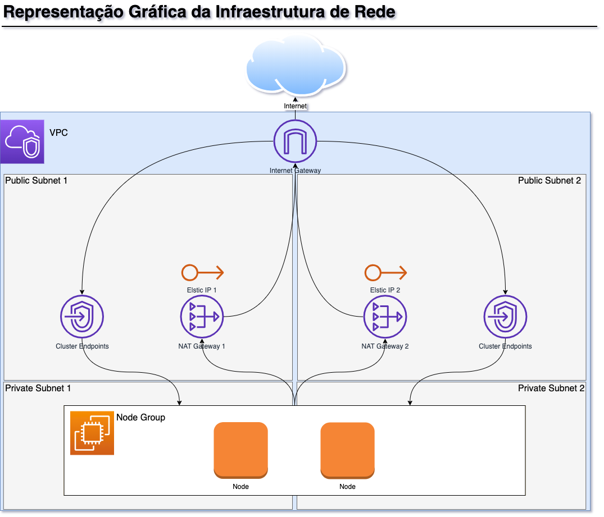

# Description

This work has been derived from the Terraform project examples with a few features and rules that I was tasked for a project. My contractor agreed to publishing an anonimized version of the resulting work. This has a lot ot moving parts and might sound awfully specifical but I hope it might serve as an example for configuration types that arent so obviously documented. 

This project conains terraform code to build an EKS cluster equiped with the following desirable Kubernetes addons for a web application:

- cluster-autoscaler: automatically adds and removes nodes based on cluster load.
- cloudwatch-fluentd: collect logs and send to Amazon Cloudwatch log groups.
  - I have included a configuration for fluentd that creates logstreams based on application names instead of container IDs.
- nginx-ingress: ingress controller reverse proxy service.
- external-dns: automatically creates and manages Route53 records based on ingress vhosts.
  - Following security recomendations the connection is made through an OIDC type authentication instead of using the node account.
- cert-manager: automatically requests certificates from LetsEncrypt based on ingress vhosts.
  - Please update cluster/cluster_issuer.yaml with your email address.

All these controllers are installed through Helm. They can be enabled or disabled through variables located in the default.tf file which also can be used to adjust some parameters. Please read the file comments before doing anything.

The resulting infrastructure also alocates two different networks for the cluster. A public network is created for the cluster and its endpoints while the worked nodes reside in a private network. LoadBalancer types of services are created with public IPv4s on the public network but have firewall rules that deny direct access therefore the only way for the internet to access those services is through the ingress loadbalancer address.

Every output connection originating from the worker nodes and its pods pass through a NAT gateway associated to an Elastic IP address. This is useful if your application makes outside connections to another service protected by a firewall that only allows packets from a certain source. 

Finally, the resulting cluster will be associated with a security group rule that only allows connections to the cluster endpoint API from the source IPv4 address of the deployer. Please adjust the VPC definitions at network/vpc.tf if you don't want that to happen.
